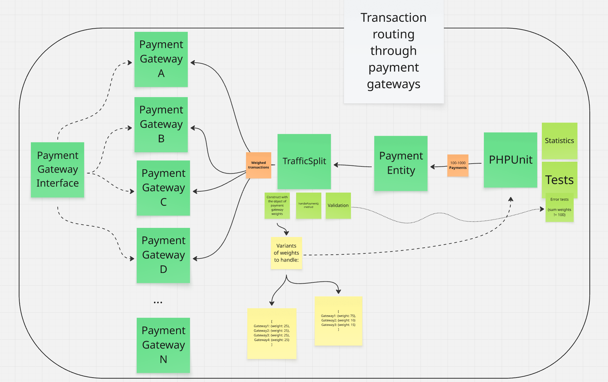

# Payment Gateway Traffic Splitter

## Requirements:

We need to develop a new feature to route transactions between several payment gateways.

### To do:
- Implement a TrafficSplit class.
- The class should have 2 public methods:
    1. Constructor – accepts a list of payment gateways with their preferred weights (percentages, must sum to 100).
    2. `handlePayment(Payment $payment)` – routes the payment according to the weights passed in the constructor.
- The solution should support many variants, for example:
    - Equal distribution (e.g. 4 gateways, each with 25%).
    - Custom weights (e.g. 75%, 10%, 15%).
- The algorithm does not need to be 100% accurate, but results should be "visible" on 100–1000 runs.
- Payment gateways implement a `getTrafficLoad(): int` method for statistics.
- Code should be maintainable, testable, and treated as a core application feature.

---

## Algorithm Choice

### Alternatives Considered

1. **Random Weighted Choice**
    - **How it works:** For each payment, randomly select a gateway proportionally to its weight.
    - **Pros:** Very simple and fast. Perfect for "online" routing where each transaction is processed immediately. In the long run, distribution matches weights.
    - **Cons:** In a short window (e.g. just a few payments), actual distribution may deviate from desired ratios.
    - **Use cases:** Online request routing, load balancers, when you don't know all transactions up front.

2. **Weighted Round Robin**
    - **How it works:** Build a queue reflecting weights (e.g. [A, A, B, C] for 50/25/25), cycle through it deterministically.
    - **Pros:** Perfect distribution even for small number of payments.
    - **Cons:** Requires storing state (pointer). Not ideal for stateless, high-concurrency or online systems.
    - **Use cases:** Batch processing, when you need guaranteed ratios for small batches.

3. **Consistent Hashing**
    - **How it works:** Assign transactions to gateways using hashes and weight intervals.
    - **Pros:** Deterministic; great for sticky sessions.
    - **Cons:** More complex, not suitable if weights need to change dynamically.
    - **Use cases:** Distributed caches, systems where session stickiness matters.

4. **Stochastic Acceptance**
    - **How it works:** Randomly pick a gateway, then accept/reject based on weight.
    - **Pros:** Good for many gateways, when some have much higher weights.
    - **Cons:** Potentially many attempts per decision.
    - **Use cases:** Niche, large-scale systems with highly variable weights.

### Why Random Weighted Choice Is Best Here?

- Payments are routed "live" as they come, not in batches.
- Simple, stateless, and doesn't require tracking past transactions.
- High testability: easy to verify statistical correctness over many runs.

---

## Solution Architecture




### Code Structure

```

src/
├── Controller/
│   └── .gitkeep
├── Entity/
│   └── Payment.php
├── Exception/
│   ├── InvalidGatewayObjectException.php
│   ├── InvalidWeightsSumException.php
│   ├── InvalidWeightValueException.php
│   └── NoPaymentGatewayRoutedException.php
├── Gateways/
│   ├── PayPalPaymentGateway.php
│   ├── Przelewy24PaymentGateway.php
│   ├── TpayPaymentGateway.php
│   └── VoltPaymentGateway.php
├── Interface/
│   └── PaymentGatewayInterface.php
├── Repository/
│   └── PaymentRepository.php
├── Service/
│   ├── TrafficSplit.php
│   └── Kernel.php
tests/
├── bootstrap.php
└── TrafficSplitTest.php
```

- **PaymentGatewayInterface** – all payment gateways implement this interface (must have `process(Payment $payment)` and `getTrafficLoad(): int`).
- **Concrete Gateways** – e.g. `Przelewy24PaymentGateway`, `TpayPaymentGateway`, etc.
- **TrafficSplit** – core class, routes transactions based on provided weights using Random Weighted Choice.
- **Payment (Entity)** – a mock entity to represent the payment object passed to the splitter.
- **Tests (PHPUnit)** – test both correct and incorrect configurations and show distribution statistics.

---

## Tests & Automation

- **Tested distributions:**
    - `[25, 25, 25, 25]` (equal)
    - `[75, 10, 15]` (custom)
    - `[30, 20, 45, 5]` (custom, more gateways)
- **Negative tests:**
    - Weights not summing to 100.
    - Zero/negative weights.
    - Invalid (non-gateway interface) objects.
- **All tests print statistics for each run.**

### For running tests locally:
``./vendor/bin/phpunit --testdox``
### Automation:
Tests are run automatically with GitHub Actions after every push to `main` or `master` branch.
<br>Workflow file: `.github/workflows/run-phpunit.yml`.

---

## Notes

- This solution is ready for extension (easy to add more gateways or change the splitting logic).
- Exception handling is done using custom exception classes for maximum clarity.

